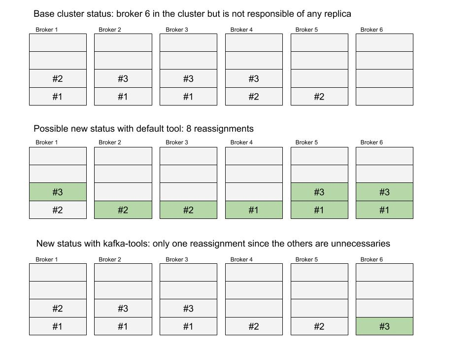

# Kafka-tools

Tool for enhancing kafka's scripts features. All features (commands) in this tool where motivated by different problems 
or challenges that we faced maintaining a kafka cluster. 

Features:
 - Generating partition reassignment file taking into account cluster current state
 - Checking lag for a particular group-id
 
## Commands
### 1. Reassign command
Command for generating `--reassignment-json-file` necessary for running `kafka/bin/kafka-reassign-partitions.sh` script

This tools takes into account the current state of the brokers, as a counterpart of `bin/kafka-reassign-partitions.sh --generate`, which randomly distributes all partitions in all brokers available in the cluster at the moment

#### Motivation
When reassigning partitions in kafka, all the partitions that are being reassigned are moving around your network. 

Also, each broker won't discard its old-partitions until all the new brokers responsible for such partitions have confirmed that have all the data. 
This means that during a reassignment, using the default kafka tool, each broker will potentially use double disk of what it really needs once the cluster is stable. 
This is because the default-tool does not take into account the current state, 
so you could be potentially moving all the partitions to a broker that did not have any replica of that partition

The motivation of this tool was to avoid reassigning partitions that are not necessary to move to achieve the desired state. This means, try to minimize the extra-space used and the network-stress when doing the reassignment

#### Features
With this tool you can (that you can't do with the default tool):
 - select only a subset of the brokers available in the cluster -> useful when you need to delete a broker
 - select only a subset of the partitions of a topic to reassign
 - select a new replication factor for the topic  

#### Example

 
### 2. Lag command
Checks a specific groupid lag, summing up all partitions' lag of a specific topic and finding the client that has more lag

#### Features
 - select only one specific topic to check lag for the specified groupid
 - check the summed lag of a groupid per each topic 

## Installation
Note: you will need to have installed sbt for installing kafka-tools

 1. Download repo
 2. Run `./install.sh` script
 3. You can now run `./kafka-tools.sh`
 
 Recommendation: if you want to be able to run kafka-tool from any directory 
 make a symbolic link in /usr/local/bin or /usr/bin to where you 
 ```
 sudo ln -s /home/ani/sources/kafka-tools/kafka-tools.sh /usr/local/bin/kafka-tools
 ```
 
## Usage
```
Despegar.com kafka-tools
Usage: kafka-tools [reassign|lag]

Command: reassign [options]
Generate partition reassignments
  -k, --kafka-dir <value>  kafka's directory
  -t, --topic <value>      topic of which want to generate partition reassignments
  -z, --zookeeper-path <value>
                           kafka's zookeeper path
  -b, --broker-ids <value>
                           Comma separated list of whitelisted brokers to spred replicas across
  -p, --partitions <value>
                           partitions to reassign. If not provided all partitions are reassigned
  -r, --replication-factor <value>
                           new replication factor. If not provided partitions are reassigned taking into account the topic actual RF
  -f, --file-name <value>  fully qualified file name to generate json. If not provided generated in /tmp/reassignPartitions.json
Command: lag [options]
Checks lag of determined groupid
  -k, --kafka-dir <value>  kafka's directory
  -g, --group-id <value>   consumer group-id
  -s, --bootstrap-servers <value>
                           kafka's bootstrap servers
  -t, --topic <value>      topic of which want to evaluate lag. If not provided all topics consumed by the group-id will me evaluated
```